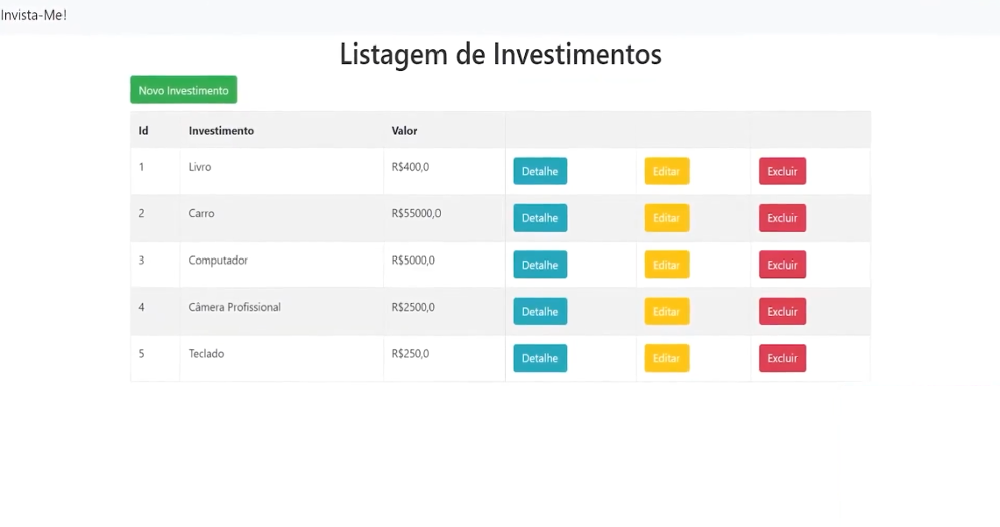

<H1>🌟 Apresento com alegria o projeto AeroFusion ! 🚀 </H1>

"Invista-me" é um projeto que surge da necessidade de simplificar o controle de finanças pessoais, oferecendo uma ferramenta poderosa e acessível para a gestão de investimentos. 
  A proposta principal deste sistema é permitir que os usuários possam, de maneira prática e eficiente, adicionar, alterar e excluir investimentos, além de gerenciar valores, facilitando assim o acompanhamento detalhado de suas finanças.

A aplicação foi desenvolvida utilizando Python, uma linguagem de programação conhecida por sua simplicidade e versatilidade, e Django, um framework robusto que permite a criação de aplicações web seguras e escaláveis. 
Com essas tecnologias, "Invista-me" oferece uma interface intuitiva e responsiva, proporcionando uma experiência de usuário fluida tanto em dispositivos móveis quanto em desktops.

Uma das grandes vantagens do "Invista-me" é a capacidade de personalização e controle que ele oferece. 
Os usuários podem adicionar novos investimentos, como ações, fundos, ou qualquer outro tipo de ativo, e acompanhar o desempenho de cada um ao longo do tempo. Além disso, a plataforma permite alterar os valores dos investimentos conforme necessário, 
atualizando automaticamente as projeções financeiras e garantindo que os dados estejam sempre atualizados.

Outro ponto forte do "Invista-me" é a funcionalidade de exclusão de investimentos, permitindo que os usuários removam ativos que já não fazem parte de sua carteira, sem complicações. 
Esse recurso é essencial para manter a organização e a clareza das informações financeiras, evitando a confusão com dados obsoletos ou irrelevantes.

Além das funcionalidades principais, o "Invista-me" foi projetado com foco na segurança dos dados, garantindo que as informações financeiras dos usuários sejam protegidas contra acessos não autorizados. 
O uso de Django contribui para essa segurança, oferecendo uma base sólida e confiável para o desenvolvimento da aplicação.

Em resumo, "Invista-me" é mais do que uma simples ferramenta de controle financeiro; é um aliado na gestão de investimentos, proporcionando aos usuários um controle total sobre suas finanças, 
com a simplicidade e eficiência que só Python e Django podem oferecer. Com "Invista-me", acompanhar e otimizar seus investimentos nunca foi tão fácil.

		
<h4>Desenvolvido pelas Linguangens:</h4>
<ul>
	<li></li>
  <li></li>
</ul>
